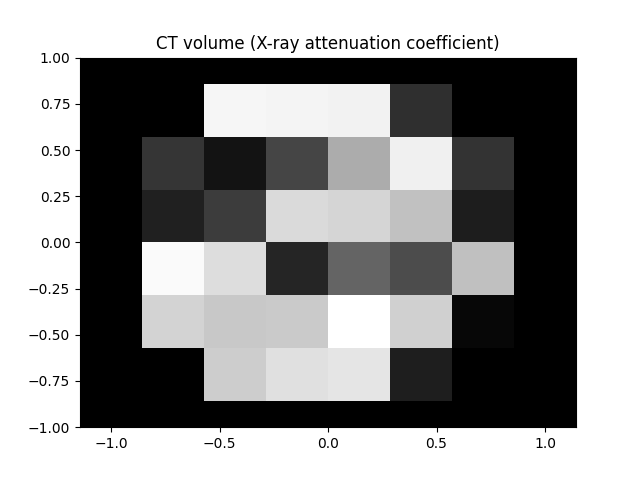
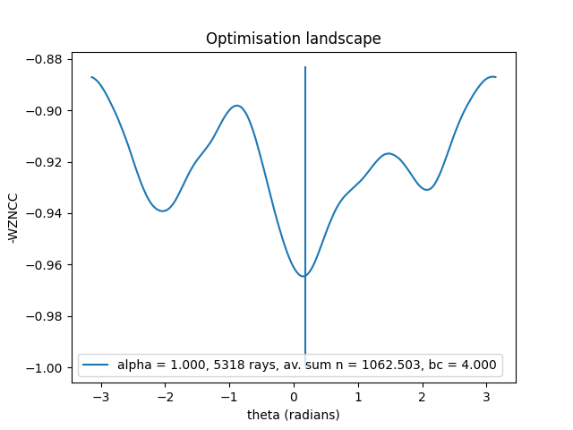
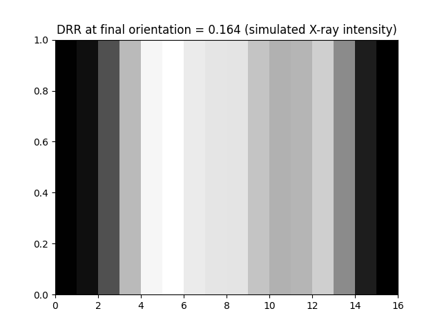
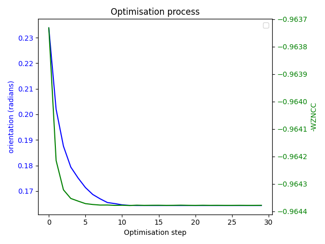

# Radiographic 2D/3D image registration with random rays

So far, the implementation is just for the analogous 1D/2D registration problem, of a 1D fixed X-ray image, and a 2D
moving CT image.

## Modules

### `tools`

Some simply mathematical operations on images and vectors.

### `ray`

A ray is stored as a row of a 4-column tensor. The first 2 values are a position in CT space through which the ray
passes, and the final 2 values are a unit-length direction vector of the ray.

This module contains some basic functions for manipulating rays stored as rows of `torch.Tensor`s.

### `data`

Classes for holding 1D and 2D images, with corresponding sampling with rays.

### `registration`

A class holding information about a registration problem.

### `random_rays`

A class implementing functionality for solving a registration problem using random rays.

## Scripts

### `main`

Sets up a registration problem and implements workflows for
- visualising the optimisation landscape, and
- registering using an optimiser.

#### Example output:

For a randomly generated CT volume:

And a randomly chosen orientation: `-0.188 radians`, giving the following DRR through the volume:

The optimisation landscape using the random rays technique with hyperparameters as follows:
- `alpha = 1.0`
- `ray_density = 1000.` for a ray count of `5318`
- `blur_constant = 4.`

looks like this:

Running ASGD on this from a random starting position converged on an orientation of `0.164 radians`, which managed to be
in the same local minimum as the global minimum. A DRR taken at this orientation is as follows:

The WZNCC and orientation developed as follows over the course of the optimisation:

