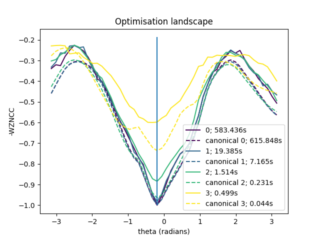
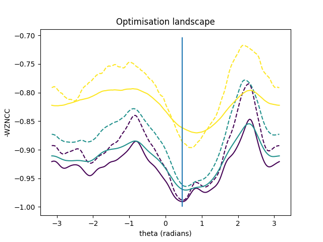
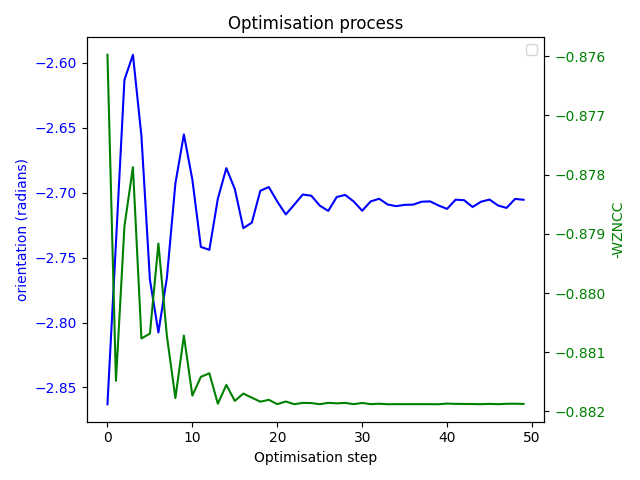

# Radiographic 2D/3D image registration with random rays

Experimental implementation of 2D/3D image registration method, with a moving 3D image and a fixed 2D image.

The analogous 1D/2D image registration task is also implemented.

See [RandomRays.pdf](RandomRays.pdf) for a detailed motivation, derivation and explanation.

# Scripts

## `two_d_three_d.main`

Sets up a 2D/3D registration problem with workflows for
- checking the match between the transformed pre-calculated rays and the fixed image
- visualising the optimisation landscape
- qualitatively and quantitatively analysing the shape of the optimisation landscape for this method and the canonical
method of registering down-sampled DRRs
- registering using an optimiser.

### Example output for  `plot_landscape`:

The following plots the (estimated) similarity between DRR and fixed image against a single rotational parameter of the
SE3 transformation, where the central value results in an identical transformation to that of the fixed image.

The solid lines are generated using pre-calculated random rays. Each colour represents a different number of rays,
resulting in different total computation times for the 50 values. The hyperparameter `alpha` is set for each number
of rays such that the sum of pair weights is approximately `5000`, and the hyperparameter `blur_constant` is `1`.

The dashed lines are generated using the standard ('canonical') method of generating a down-sampled DRR to compare with
a down-sampled version of the fixed image. Each colour represents a different scale of down-sampling, resulting in
different total computation times for the 50 values.

The total computation times for each series are shown in seconds in the legend.

Ray counts / down-sample factors:
- 0: 100,000,000 pre-calculated rays / full resolution
- 1: 6,250,000 pre-calculated rays / down-sampled by 4
- 2: 390,625 pre-calculated rays / down-sampled by 16
- 3: 24,414 pre-calculated rays / down-sampled by 64

## `one_d_two_d.main`

Sets up a registration problem and implements workflows for
- visualising the optimisation landscape, and
- registering using an optimiser.

### Example output:

For a randomly generated CT volume:

And a randomly chosen orientation: `-0.188 radians`, giving the following DRR through the volume:

The optimisation landscape was evaluated using the random rays technique with hyperparameters as follows:
- `ray_density = 1000.` for a ray count of `5318`
- `blur_constant = 4.`

with different values of alpha (differentiated by colour), and with/without clipping rays to within the X-ray image
(dashed=clipped):

Running ASGD on this from a random starting position converged on an orientation of `0.164 radians`, which managed to be
in the same local minimum as the global minimum. A DRR taken at this orientation is as follows:

The WZNCC and orientation developed as follows over the course of the optimisation:

# Modules

### `tools`

Some simple mathematical operations on images and vectors.

### `registration`

A class holding information about a registration problem.

### `random_rays`

A class implementing functionality for solving a registration problem using random rays.

### `debug`

Simple tool for printing out progress through script, and timing tasks.

### `correlation_measure`

Tool for measuring the correlation between the input and output of a random function, where the domain of the function
is sampled evenly through a particular range.

## `two_d_three_d`

### `two_d_three_d.ray`

A ray is stored as a row of a 6-column tensor. The first 3 values are a position in CT space through which the ray
passes, and the final 3 values are a unit-length direction vector of the ray.

This module contains some basic functions for manipulating rays stored as rows of `torch.Tensor`s.

### `two_d_three_d.data`

Classes for holding 2D and 3D images, with corresponding sampling with rays.

## `one_d_two_d`

### `one_d_two_d.ray`

A ray is stored as a row of a 4-column tensor. The first 2 values are a position in CT space through which the ray
passes, and the final 2 values are a unit-length direction vector of the ray.

This module contains some basic functions for manipulating rays stored as rows of `torch.Tensor`s.

### `one_d_two_d.data`

Classes for holding 1D and 2D images, with corresponding sampling with rays.

